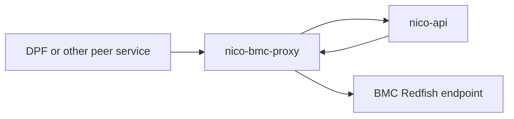
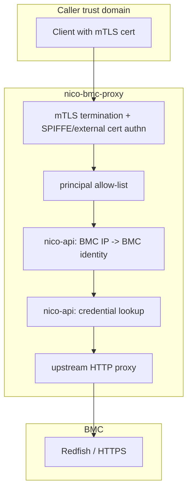
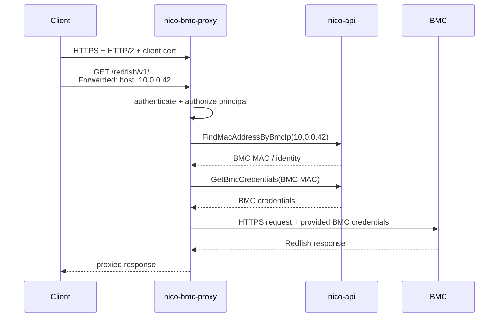

# nico-bmc-proxy

A small authenticated HTTP/2 proxy for BMC access:

- authenticates callers with mTLS
- authorizes callers by service principal
- maps `Forwarded: host=<bmc_ip>` to a known BMC through nico-api
- fetches the BMC's credentials from nico-api over gRPC
- proxies the HTTP request to the target BMC

The point is to keep BMC authentication and credential handling in one place, while allowing multiple higher-level systems to coexist as peers.

## Configuration

The binary is started with:

```bash
cargo run -p nico-bmc-proxy -- --config-path /path/to/bmc-proxy.toml
```

Important configuration fields:

- `listen`: proxy listen address, default `[::]:1079`
- `metrics_endpoint`: metrics listen address, default `[::]:1080`
- `allowed_principals`: authorized caller principals, for example `spiffe-service-id/<name>`
- `tls.*`: server certificate, key, and trust roots for mTLS
- `nico_api.*`: nico-api gRPC endpoint and mTLS material used for BMC IP resolution and `GetBmcCredentials`
- `auth.trust.*`: SPIFFE trust domain and allowed base paths
- `auth.acls`: per-principal ACL rules for HTTP method and path authorization
- `auth.cli_certs`: optional criteria for externally issued admin/client certs
- `bmc_proxy`: optional upstream override for dev/test chaining
- `class`: optional request classes that set how long the proxy waits on the
  BMC, and how many of their requests it sends to a BMC at a time; see
  [`class`](#class)
- `admission`: optional limit on the requests the proxy sends to each BMC; see
  [`admission`](#admission)

Example shape:

```toml
listen = "[::]:1079"
metrics_endpoint = "[::]:1080"
allowed_principals = ["spiffe-service-id/dpf"]

[tls]
identity_pemfile_path = "/var/run/secrets/spiffe.io/tls.crt"
identity_keyfile_path = "/var/run/secrets/spiffe.io/tls.key"
root_cafile_path = "/var/run/secrets/spiffe.io/ca.crt"
admin_root_cafile_path = "/etc/nico/nico-bmc-proxy/site/admin_root_cert_pem"

[nico_api]
root_ca = "/var/run/secrets/spiffe.io/ca.crt"
client_cert = "/var/run/secrets/spiffe.io/tls.crt"
client_key = "/var/run/secrets/spiffe.io/tls.key"
api_url = "https://nico-api.nico-system.svc.cluster.local:1079"

[auth.trust]
spiffe_trust_domain = "nico.local"
spiffe_service_base_paths = ["/nico-system/sa/", "/default/sa/"]
spiffe_machine_base_path = "/nico-system/machine/"
additional_issuer_cns = []

[auth.acls]
"spiffe-service-id/dpf" = ["/redfish/v1/**"]
```

### `auth.acls`

`auth.acls` maps an authenticated principal to an ordered list of ACL entries:

```toml
[auth.acls]
"spiffe-service-id/nico-api" = ["/**"]
"spiffe-service-id/nv-dps" = [
  "GET /redfish/v1",
  "GET,POST /redfish/v1/Managers/BMC/NodeManager/Domains",
  "GET,PATCH,DELETE /redfish/v1/Managers/BMC/NodeManager/Domains/*",
]
```

Each ACL entry has the form:

```text
[!]VERB[,VERB...] /path/pattern
```

Rules:

- The leading `!` means deny. Without it, the entry allows.
- If the verb list is omitted, the entry matches any HTTP method.
- Entries are evaluated in order. The first matching entry wins.
- If no entry matches, the request is denied.
- ACLs are scoped per principal. A principal with no ACL list is denied.

Path matching syntax:

- Exact path components match literally.
- `*` matches exactly one path component.
- `prefix*` matches one path component with the given prefix.
- `*suffix` matches one path component with the given suffix.
- `**` matches zero or more path components.
- A single trailing slash does not create another path component. For example,
  `/redfish/v1/` matches `/redfish/v1`. Some clients include this slash when
  requesting the Redfish service root.
- A single `*` may appear by itself, at the beginning, or at the end of a path component.
  Valid: `/redfish/v1/Systems/*/SecureBoot/**`
  Valid: `/redfish/v1/Systems/system*/SecureBoot`
  Valid: `/redfish/v1/Systems/*Boot/SecureBoot`
  Invalid: `/redfish/v1/Systems/sys*tem/SecureBoot`
- At most one `**` is allowed in an ACL path.

Examples:

- `"/**"`
  Allow a principal to access any path with any method.
- `"GET /redfish/v1/**"`
  Allow only `GET` requests anywhere under `/redfish/v1`.
- `"!POST,PATCH /redfish/v1/Systems/*/SecureBoot/**"`
  Deny writes below any system's `SecureBoot` subtree.
- `"GET,POST /redfish/v1/Managers/BMC/NodeManager/Domains"`
  Allow both listing and creating node manager domains on the same path.

If you are translating endpoint docs into ACLs, replace templated path components such as
`{id}`, `{session_id}`, or `{policy_id}` with `*`.

### `class`

Each `[[class]]` table groups proxied requests that share an upstream budget
and admission settings:

```toml
[[class]]
name = "inventory"
match = ["GET /redfish/v1/UpdateService/FirmwareInventory/**"]
upstream_timeout = "3m"

[[class]]
name = "default"
upstream_timeout = "90s"
```

- `name`: the class's name on the request's trace span, as `bmc_proxy.class`,
  and its `class` label on the admission metrics.
  A lowercase letter followed by lowercase letters, digits, or `_`, at most
  32 characters in all, and unique across the tables.
- `match`: an array of the requests the class takes, each written like an ACL
  entry without a leading `!`: optional comma-separated methods (`GET`,
  `HEAD`, `POST`, `PUT`, `PATCH`, or `DELETE`, in any case), then a path in
  the syntax above. Required for every class but `default`.
- `upstream_timeout`: how long one exchange with the BMC may take, as a
  duration string such as `"500ms"`, `"45s"`, or `"5m"`, above zero and at
  most 30 minutes. A class that omits it gets 60 seconds, not the `default`
  class's budget.
- `priority`: from 0 to 255, higher first; orders the requests of different
  classes waiting for the same BMC under `max_in_flight_per_bmc`, and has no
  effect without it. Optional, 0 by default.
- `max_in_flight`: how many of the class's requests one proxy replica sends
  to one BMC at a time, at least 1. Optional; unlimited by default.
- `max_queued`: how many of the class's requests may wait for one BMC at a
  time, from 1 to 128; a request that stops waiting gives up its place, and
  one more than this is refused with `503` at once. Requests arriving
  together on their way to free slots do not count. Optional, 16 by default.
  Each BMC in use costs the proxy memory in proportion to the `max_queued` of
  every class that takes slots.

The budget covers looking up the BMC's credentials in nico-api and any wait
for a slot at the BMC (see [`admission`](#admission)), then runs from
connecting to the BMC until the proxy has read the last byte of the BMC's
response body, redirects the proxy follows included. Most
bodies are passed on to the caller as they are read, so a slow caller spends
the budget too. When the budget runs out before the BMC answers, the caller
gets `502`; when it runs out while the body is being passed on, the body is
cut off. A request the proxy replays with fresh credentials gets a budget of
its own, which covers looking up the fresh credentials. A streamed upload (a
body over 8 MiB that declares its length) looks up credentials and waits for
a slot within its class's budget, then gets a budget of its own for the
transfer, scaled from its declared size: 60 seconds plus the transfer at
10 kB/s, at most four hours.

A request belongs to the first class, in file order, with a matching pattern.
A request no class matches belongs to `default`, whose budget is 60 seconds;
declare `default`, without `match`, only to change that or its admission
settings. A budget longer than
the caller's own deadline does not help that caller. A `[[class]]` table that
breaks these rules, or has a key not listed here, stops the proxy from
starting.

### `admission`

The proxy can limit how many requests it sends to each BMC at a time, and
choose which waiting request goes next:

```toml
[admission]
max_in_flight_per_bmc = 4

[[class]]
name = "power"
match = ["PATCH /redfish/v1/**/EnvironmentMetrics"]
priority = 1

[[class]]
name = "metrics"
match = ["GET /redfish/v1/**/EnvironmentMetrics"]
max_in_flight = 2
```

- `max_in_flight_per_bmc`: how many requests one proxy replica sends to one
  BMC at a time, across all classes, at least 1. Optional; unlimited by
  default. A class's own `max_in_flight` applies within it. An `[admission]`
  table with a key not listed here stops the proxy from starting.

A request takes a slot at its BMC before the proxy sends it when its class
sets `max_in_flight` or `max_in_flight_per_bmc` is set; otherwise it is sent
at once. The proxy looks up the BMC's credentials first, so a request for an
address nico-api has no BMC credentials for gets `502` without taking a slot
or a place in a queue. A request holds its slot until the proxy has passed
the whole response on to the caller, or the exchange has failed; a replay
with fresh credentials keeps the same slot. From the moment it gets the
slot, it holds it no longer than its exchange with the BMC can take, though:
twice its class's budget, for a first attempt and a replay, or its class's
budget and its own for a streamed upload. Past that, the slot goes to the
next waiting request, so a caller that stops reading cannot keep it, though
the proxy keeps that response's connection to the BMC open until the caller
reads on or goes away.

A request that finds no free slot waits at the proxy in its class's queue for
that BMC. A freed slot goes to the highest-priority class that has a request
waiting and is under its own `max_in_flight`; classes of equal priority take
turns, and each class's requests go in the order they came. A class gets no
slot while a higher-priority class has a request waiting that its
`max_in_flight` lets through, and its requests are refused when their budget
runs out. A request whose caller disconnects gives up its place, except a
streamed upload over HTTP/1, whose caller the proxy finds gone only once it
starts sending the upload.

Waiting spends the request's budget, and a request that waited has only the
rest of it for its first exchange with the BMC; a streamed upload keeps its
own. The proxy refuses a request with `503` and a plain-text body giving the
reason when its class's queue at the BMC is full of requests still waiting,
when no slot frees within its budget, when the proxy already tracks 100,000
BMCs, or when the proxy is shutting down. It counts refusals in
`carbide_bmc_proxy_admission_refused_total`, by `class` and `reason`
(`queue_full`, `timeout`, `too_many_bmcs`, or `shutting_down`), and records
the waits of requests that got a slot in
`carbide_bmc_proxy_admission_wait_milliseconds`.

Limits are per proxy replica: with two replicas, a BMC can receive up to twice
a limit. A request the BMC is already handling cannot be overtaken, so keep
the classes whose requests are slow, and streamed uploads, which can hold a
slot for hours, at a `max_in_flight` below `max_in_flight_per_bmc`, leaving
slots for the others.

## Example Request

```bash
curl --http2 \
  --cert /path/to/tls.crt \
  --key /path/to/tls.key \
  -H 'Forwarded: host=192.168.192.8' \
  https://bmc-proxy.example/redfish/v1/Systems/Bluefield
```

The client chooses the BMC by IP. The proxy performs authentication, credential lookup, and backend authentication.

## Why?

We have at least two valid constraints at the same time:

1. NICo cannot assume it will be the only system that ever talks to BMC's.
2. We don't want to distribute BMC credentials to every system that needs BMC access

So an authenticating proxy makes it so any system needing to talk to BMC's can do so without needing to spread credentials around.

An alternative approach is to have nico-api be the only service that talks to BMC's, and have all operations on BMC's be implemented as high-level gRPC methods on nico-api. But this isn't really a scalable approach: there is other management software (such as [NVIDIA Domain Power Service (DPS)][DPS]) that cannot take a dependency on nico, and these systems need to coexist. So in order to support this without sharing BMC credentials, the idea is that each system should be configurable to use a general-purpose proxy for talking to BMC's, and nico-bmc-proxy is merely an implementation of this.

## What's Using It?

nico-api routes its own eligible BMC Redfish traffic through nico-bmc-proxy when its static `[bmc_proxy]` configuration section is enabled: machine-lifecycle traffic and the credentialed exploration of endpoints whose stored root credential is established. Credential-subject operations (credential setup, BMC session minting, password rotation, UEFI password management) and the other documented exceptions stay direct, so nico-api still holds BMC credentials. The routing contract, including every direct-path exception, is in [`crates/api-core/src/cfg/README.md`](../api-core/src/cfg/README.md#bmcproxyconfig--bmc_proxy).

We soon expect that [DPS] will support configuration of an authenticating proxy like this one, to manage power configuration on BMC's. DPS is a standalone service that should not have a direct dependency on nico-api. So nico-bmc-proxy serves an implementation of such a proxy, although any proxy that implements similar functionality can work.

Future work can move the remaining direct paths behind the proxy so that nico-api no longer holds BMC credentials at all.

## Architecture

Today, the proxy reuses existing NICo-adjacent building blocks:

- `nico-authn`: mTLS and SPIFFE principal extraction
- `nico-rpc`: nico-api gRPC client used for BMC IP resolution and credential lookup

### Dependency View



The important point in this picture is that both `nico-api` and external peers consume the same proxy. External peers never need BMC passwords. nico-api still holds them: it is the proxy's credential source, and its credential-subject operations dial BMCs directly.

### Trust Boundary View



The caller authenticates with a client certificate. If the caller is authorized, nico-bmc-proxy looks up the target BMC, retrieves the corresponding credentials, and performs the backend request itself.

### Request Sequence



## Future Direction

This crate is meant to implement a clean architectural boundary, but the implementation still couples to nico in slightly uncomfortable ways:

1. It's still a component of the infra-controller repo, so it's not fully independent
2. It expects nico-api to resolve proxied BMC IPs through `FindMacAddressByBmcIp`.
3. It expects nico-api to return credentials from `GetBmcCredentials` for every proxied BMC.

Point #1 doesn't really need to be solved, since there's no problem storing the crate in this repo and taking advantage of existing code. But future work can focus on making nico-bmc-proxy:

- Keep its own persisted configuration state, so that it can "own" IP-to-credentials lookups, rather than relying on nico-api's state
- Provide an admin/management API for setting/storing/rotating credentials (which nico-api can call when configuring hosts.)

At which point we can strip all BMC credential storage code out of nico-api and have it use this crate for BMC interaction.

[DPS]: https://docs.nvidia.com/datacenter/dps/versions/latest/
